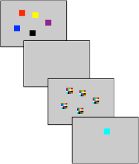

```{r setup, include=FALSE}
knitr::opts_chunk$set(echo = FALSE)
```

## Change Detection
<div class="columns-2">

[Rouder et al. (2008)](http://www.pnas.org/content/105/16/5975)

</br>



</br>

</br>

- Is there a fixed capacity limit to visual working memory?
- Manipulated:
    - set size (number of items to remember): 2, 5, or 8
    - probability of a change occuring: 30%, 50%, or 70% of trials

</div>

## Change Detection

- Cowan (2001) suggested a way of estimating the number of items in working memory, $k$, using the change detection task
- $d = \min(k/N, 1)$ = probability that the probed item is in memory
- If the probed item is in memory the participant responds correctly. If it isn't, they must guess:
    - $p(\mbox{resp} = \mbox{change} \mid \mbox{change}) = p_h =  d + (1 - d)g$
    - $p(\mbox{resp} = \mbox{no-change} \mid \mbox{change}) = p_f = (1 - d)g$
- This gives a formula for $k$:
    - $p_h = k/N + p_f \rightarrow k = N(p_h - p_f)$

## Change Detection

- But this formula only works one set size at a time and doesn't work for $k > N$
- Rouder et al. (2008) used MLE to fit a single $k$ across multiple set sizes
- This model didn't fit very well...
- At set size 2 the model predicted perfect performance, but none of the participants performed absolutely perfectly
- To account for errors at low set sizes they added an attention parameter, $a$, which was the probability that the participant attended a given trial. $1 - a$ is their lapse rate.

## The extension for 'lapsing'

If people lapse, they guess

$$
p(\mbox{resp} = \mbox{change} \mid \mbox{change}) = p_h =  a(d + (1 - d)g) + (1 - a)g
$$

$$
p(\mbox{resp} = \mbox{no-change} \mid \mbox{change}) = p_f = a(1 - d)g + (1 - a)g
$$

## Result

```{r, out.width = "400px", echo=F}
knitr::include_graphics("pictures/rouder08.png")
```

## Other models

- Rouder et al. (2008) also considered a version of the model where $k$ was free to vary by set size. The fixed capacity version faired better.

- They also fit a signal detection theory model, where the probe is always assumed to be in memory. Set size is assumed to reduce sensitivity as a resource is spread more thinly across the items.

## SDT model

```{r}

par(mar=c(4,3,1,1))
curve(expr = dnorm(x, 0, 1), from = -3, to = 6, xlab="Strength of evidence for 'change'", ylab="", lwd=2)

curve(expr = dnorm(x, 1, 1.2), col="tomato", from = -3, to = 6, lwd=2, add = T)
curve(expr = dnorm(x, 2, 1.2), col="forestgreen", from = -3, to = 6, lwd=2, add = T)
curve(expr = dnorm(x, 3, 1.2), col="dodgerblue", from = -3, to = 6, lwd=2, add = T)

legend("topleft", legend = c(2,5,8), lty = 1, col = c("dodgerblue", "forestgreen","tomato"), title = "N", lwd=2, bty='n')

```

# Implementing these models in R

## Implementing these models in R

We need three elements

- A `function()` to generate the predictions from the models given some parameter settings
- A `function()` to calculate the likelihood of the parameters given the data
- A `function()` that combines the above two into a specific version of the model (e.g. one that restricts certain parameters)

## Implementing these models in R

We need to write this function with an understanding of what form the data are in. 

The data are given with one participant per row with numbers of *hits*, *misses*, *false alarms*, and *correct rejections* (order is important) for each set size.

*Note* we only look at the data from the 50% change condition to simplify things.

```{r, echo=T}
cd = read.table(file = "data/rouder08-data-0.5.dat")
head(cd, n = 1)
```

## Prediction functions | Fixed capacity model

With that in mind we make our prediction functions return in the same order

```{r, echo=T}
cowan_k <- function(k, a, g, N){
  d = min(1,k/N) # p(probe in memory)
  
  p = 1:4
  p[1] = a*(d+(1-d)*g)+(1-a)*g # p(hit)
  p[2] = 1-p[1] # p(miss)
  p[3] = a*(1-d)*g+(1-a)*g # p(false-alarm)
  p[4] = 1-p[3] # p(correct rejection)
  return(p)
}
```

## Prediction functions | Signal detection model

With that in mind we make our prediction functions return in the same order

```{r, echo=T}
sdt <- function(d, c, s){
  # this is a simplified version of the sdt 
  # model used by rouder et al.
  p = 1:4
  p[1] = pnorm((d - c)/s) # p(hit)
  p[2] = 1 - p[1] # p(miss)
  p[3] = pnorm(- c) # p(false-alarm)
  p[4] = 1 - p[3] # p(correct rejection)
  return(p)
}
```

## Likelihood function

```{r, echo=T, eval=F}
# Multinomial Negative Log-Likelihood
negLL <- function(y,p){
  a=ifelse(y==0 & p==0,0, y*log(p))
  -sum(a)
}
# this seems to work better than dmultinom 
```

## Model functions | Fixed capacity model

```{r, echo = T}
N = c(2,5,8)
N_i = rep(1:length(N), each=4) # index

# fixed capacity model
ll.fixed_k <- function(par, y){
  # length(par) == 3 (k, a, g)
  ll=0
  for(i in 1:length(N)){ # for each set size
    p = cowan_k(k = par[1], a = par[2], g = par[3], N = N[i])
    ll = ll + negLL(y[N_i==i], p)
  }
  if(any(c(par < rep(0,3), par > c(max(N),1,1)))){
    ll = ll + 10000 # penalty for going out of range
  }
  return(ll)
}
```

## Model functions | Variable capacity model

```{r, echo = T}
N = c(2,5,8)
N_i = rep(1:length(N), each=4) # index

# variable capacity model
ll.vary_k <- function(par, y){
  # length(par) == 5 (k*3, a, g)
  ll=0
  for(i in 1:length(N)){ # for each set size
    p = cowan_k(k = par[i], a = par[4], g = par[5], N = N[i])
    ll = ll + negLL(y[N_i==i], p)
  }
  if(any(c(par < rep(0,5), par > c(rep(max(N), 3),1,1)))){
    ll = ll + 10000 # penalty for going out of range
  }
  return(ll)
}
```

## Model functions | Equal-variance signal detection model

```{r, echo = T}
N = c(2,5,8)
N_i = rep(1:length(N), each=4) # index

# signal detection model with equal variance for change and no-change items
ll.sdt.ev <- function(par, y){
  # length(par) == 4 (d1, d2, d3, c)
  ll=0
  for(i in 1:length(N)){ # for each set size
    p = sdt(d = par[i], c = par[length(N)+1], s = 1)
    ll = ll + negLL(y[N_i==i], p)
  }
  return(ll)
}
```
