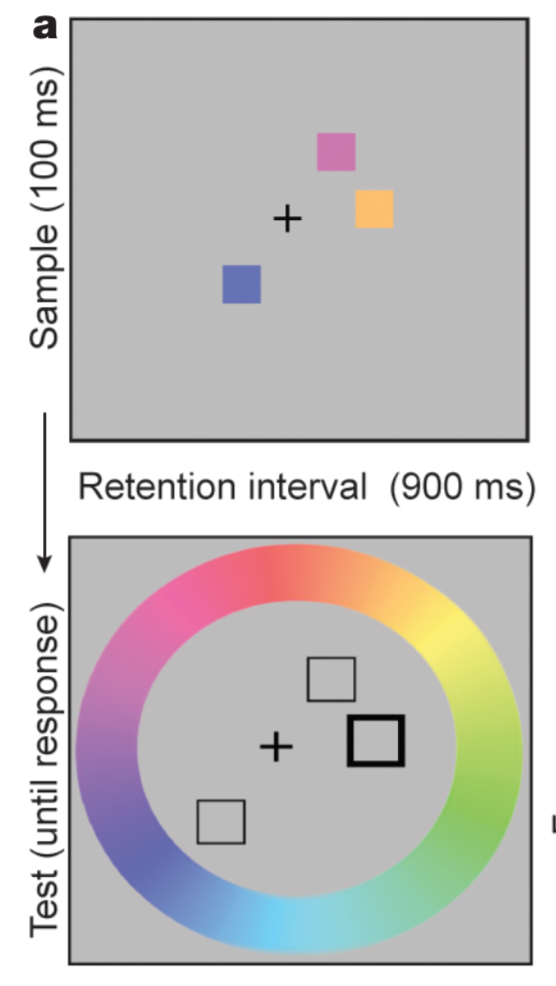

```{r setup, include=FALSE}
knitr::opts_chunk$set(echo = FALSE)
```

## Overview

We're going to work through some example models

- Change detection data (from yesterday)
- Delayed estimation recall error
- SDT model of confidence rating data

These examples use binomial (accuracy), continuous, and ordinal data, respectively.

# Change Detection

## Rouder et al. (2008) data

The data is structured differently from the MLE example

```{r, echo=T}
cd = read.table(file = "jags-change-det/rouder08-longdata-0.5.dat")
head(cd)
# ischange = was the trial a change trial? 1 = yes, 0 = no
# respchange = the number of trials that the participant said 'change' to
# ntrials = number of trials of that type for that participant in that condition
```

## Rouder et al. (2008)

- See `jags-rouder08.R`
- Reminder of the model:

$$
p(\mbox{resp} = \mbox{change} \mid \mbox{change}) = h =  a(d + (1 - d)g) + (1 - a)g
$$

$$
p(\mbox{resp} = \mbox{change} \mid \mbox{no-change}) = f = a(1 - d)g + (1 - a)g
$$

## In JAGS

```{r, eval=F, echo=T}
      # p(resp = change)
      P[i] <- ifelse(ischange[i] == 1, 
                     a[i]*(d[i]+(1-d[i])*g[i]) + (1-a[i])*g[i], # p(hit)
                     a[i]*(1-d[i])*g[i] + (1-a[i])*g[i]) # p(false-alarm)
```

## Rouder et al. (2008) hierarchical model

Parameters for participant $i$ are drawn from independant normals

$\kappa_i \sim \mbox{Normal}(\mu_\kappa, \sigma_\kappa)$

$k_i = \max(\kappa_i, 0)$ (see [Morey, 2011](http://isiarticles.com/bundles/Article/pre/pdf/71624.pdf))

$\mbox{logit}(a_i) \sim \mbox{Normal}(\mu_a, \sigma_a)$

$\mbox{logit}(g_i) \sim \mbox{Normal}(\mu_g, \sigma_g)$

## logit

$\mbox{logit}(p) = \ln(p/(1-p))$

Maps probabilities onto real numbers (so we can sample participant parameters from normal distributions)

```{r, fig.height=4}
curve(qlogis(x), from=0, to=1, main="", xlab="p", ylab="logit(p)")
```

## In JAGS

```{r, eval=F, echo=T}
k[i] <- max(kappa[i], 0) # 'Mass-at-chance' transformation
kappa[i] <- K_s[id[i]]
logit(a[i]) <- A_s[id[i]] # logit transformation
logit(g[i]) <- G_s[id[i]]
```

```{r, eval=F, echo=T}
for (s in 1:S){
  K_s[s] ~ dnorm(K_mu, 1/K_sigma^2)
  A_s[s] ~ dnorm(A_mu, 1/A_sigma^2)
  G_s[s] ~ dnorm(G_mu, 1/G_sigma^2)
}
```

## Priors

$\mu_\kappa \sim \mbox{Normal}(3, 4)$

$\mu_a \sim \mbox{Normal}(2.2, 4)$ (`plogis(2.2)` $\approx$ 0.9)

$\mu_g \sim \mbox{Normal}(0, 4)$ (`plogis(0)` = 0.5)

```{r, eval=F, echo=T}
K_mu ~ dnorm(3, 1/4^2) 
A_mu ~ dnorm(2.2, 1/4^2) 
G_mu ~ dnorm(0, 1/4^2) 
```

## Priors

$\sigma_\kappa \sim \mbox{Gamma}(s, r)$

$\sigma_a \sim \mbox{Gamma}(s, r)$

$\sigma_g \sim \mbox{Gamma}(s, r)$

```{r, eval=F, echo=TRUE}
K_sigma ~ dgamma(shape, rate)
A_sigma ~ dgamma(shape, rate)
G_sigma ~ dgamma(shape, rate)

shape <- 1.01005
rate <- 0.1005012
```

## Priors

```{r}
curve(dgamma(x, shape = 1.01005, rate = 0.1005012), from=0, to=20, n = 10000, ylab="", xlab=bquote(sigma), lwd=2)
```

# Delayed Estimation

## Delayed Estimation

- Study items that vary on a continuous (usually circular dimension)
- Reproduce a probed item

## Zhang and Luck (2008)

- Another example using colored squares!

```{r, out.width = "200px", echo=F}

```

## Zhang and Luck (2008) - data

```{r, echo=T}
de = read.table("delayed-estimation/zhang-luck08.dat")

head(de)
```

## Zhang and Luck (2008) - data

```{r, echo=F}
colors = rainbow(4, alpha = .5)
par(mfrow = c(2,2), mar=c(3,3,2,2))
Ns = unique(de$setsize)
Ns = Ns[order(Ns)]

for (i in 1:4){
  N = Ns[i]
  with(subset(de, setsize==N), hist(error, main=paste0("N = ", N), xlab="error (rad)", ylab="", col=colors[i], breaks=30))
}

```

## Zhang and Luck (2008) - models

Responses are a *mixture* of memory responses and random guesses

$p(y = x) = P_{m}\mbox{vonMises}(x; \sigma) + (1 - P_m)\frac{1}{2\pi}$

```{r, fig.height=4, echo=F, messages=F, warning=F}
library(circular, quietly = T, warn.conflicts = F)
de_mixture <- function(y, sd, pmem, mu=0, log=T){
  # delayed estimation mixture
  dvon = suppressWarnings(dvonmises(circular(y), mu = mu, kappa = 1/sd^2)) # suppresses messages about converting data to the circular class 
  p <- pmem*dvon + (1-pmem)*(1/(2*pi))
  if (log){
    return(log(p))
  }else{
    return(p)
  }
}

curve(de_mixture(x, sd = .5, pmem = .8, log=F), from=-pi, to=pi, ylim=c(0,.8), ylab='', xlab="Error (radians)", lwd=2)

curve(de_mixture(x, sd = .5, pmem = .5, log=F), from=-pi, to=pi, ylim=c(0,.8), lwd=2, add = T, col="dodgerblue")

legend('topleft', legend = c(.8, .5), lwd=2, col=c("black", 'dodgerblue'), bty='n', title="Pm")

```

## Zhang and Luck (2008) - models

They also fit a simpler version of the model where all responses are from memory and only the standard deviation of the von Mises (circular normal) distribution varies with set size.

```{r, fig.height=4, echo=F, messages=F, warning=F}

curve(de_mixture(x, sd = .5, pmem = 1, log=F), from=-pi, to=pi, ylim=c(0,.8), ylab='', xlab="Error (radians)", lwd=2)

curve(de_mixture(x, sd = 1, pmem = 1, log=F), from=-pi, to=pi, ylim=c(0,.8), lwd=2, add = T, col="dodgerblue")

legend('topleft', legend = c(.5, 1), lwd=2, col=c("black", 'dodgerblue'), bty='n', title="SD")

```

## In JAGS

## 

For both change detection and (especially) delayed estimation many more complicated models have been proposed. 

See, for example, [van den Berg et al. (2014)](http://www.cns.nyu.edu/malab/static/files/publications/2014%20Van%20den%20Berg%20Ma%20Psych%20Review.pdf)

These models provide the foundations for the more complex versions.

# SDT confidence ratings

```{r}
ratingModel <- function(d, s, a, b, C, lastPoint = T){
  # the parsimonius model from Selker et al
  # https://osf.io/v3b76/
  unb = -log((1 - 1:C/C)/(1:C/C))
  
  thresh = 1/2 + a*unb + b
  
  f = cumsum(rev(diff(pnorm(c(-Inf, thresh),0,1))))
  h = cumsum(rev(diff(pnorm(c(-Inf, thresh),d,s))))
  
  if(!lastPoint){
    f = f[1:(C-1)]
    h = h[1:(C-1)]
  }
  return(cbind(f, h))
}

plotSDT <- function(d = 2, s = 1, a = 1, b = 0, C = 6, title = F){
  par(pty='m', mar=c(4,2,3,2))
  
  xrange <- c(-3, d+3*s)
  newcol = col2rgb("dodgerblue4")[,1]
  newcol = rgb(red = newcol[1], green = newcol[2], blue = newcol[3], alpha = 50, maxColorValue = 255)
  oldcol=rgb(1,1,1,.5)
  xseq = seq(from=xrange[1], to=xrange[2], length.out = 1000)

  unb = -log((1 - 1:C/C)/(1:C/C))
  thresh = 1/2 + a*unb + b
  thresh = thresh[1:(C-1)]
  
  yrange = c(0, max(dnorm(0), dnorm(d, d, s)))
  plot(NA, ylim = yrange*c(0,1.5), xlim = xrange, ylab="", xlab="", axes=F)
  
  polygon(c(xrange[1], xseq, xrange[2]), c(0, dnorm(xseq), 0), col = newcol , border = NA)
  curve(expr = dnorm(x, 0, 1), from=xrange[1], to=xrange[2], n = 10000, add = T)
  polygon(c(xrange[1], xseq, xrange[2]), c(0, dnorm(xseq, d, s), 0), col = oldcol , border = NA)
  curve(expr = dnorm(x, d, s), from=xrange[1], to=xrange[2], n = 10000, add = T)
  
  for (k in 1:(C-1)){
    lines(x = c(thresh[k], thresh[k]), y = yrange*c(0, 1.35), lty=2, col='darkgrey')
    text(x = thresh[k], y = yrange[2]*1.4, labels = bquote(lambda[.(k)]))
  }
  
  label_x = c(xrange[1], thresh, xrange[2])[1:C] + diff(c(xrange[1], thresh, xrange[2]))/2
  
  text(x = label_x, y = yrange[2]*1.2, labels = 1:C, col='red')
  
  axis(1); box()
  
  if (title){
    mtext(text = paste0("d = ", d, ", s = ", s, ", a = ", a, ", b = ", b))
  }
  mtext(text = "Strength of Evidence for 'old'", 1, line = 2.5)
}

# par(pty='s')
# plot(ratingModel(d = 2, s = 1.2, a = 1, b = 0, C = 1000), ylim=c(0,1), xlim=c(0,1), type='l', xlab='false-alarm rate', ylab='hit rate')
# a = ratingModel(d = 2, s = 1.2, a = 1, b = 0, C = 6, lastPoint=F)
# points(a, ylim=c(0,1), xlim=c(0,1), pch=21, bg='grey')
# 
# text(t(t(a)+c(.05,-.05)), labels = 5:1)
#
# par(mfrow=c(1,2))
# 
# plotSDT(d = 2, s = 1.2, a = 1, b = -2/3, C = 6)
# mtext("Shift to the left (more liberal)")
# 
# plotSDT(d = 2, s = 1.2, a = 1, b = 1, C = 6)
# mtext("Shift to the right (more conservative)")
# 
# par(pty='s', mfrow=c(1,2))
# 
# plot(ratingModel(d = 2, s = 1.2, a = 1, b = 0, C = 1000), ylim=c(0,1), xlim=c(0,1), type='l', xlab='false-alarm rate', ylab='hit rate')
# a = ratingModel(d = 2, s = 1.2, a = 1, b = -2/3, C = 6, lastPoint=F)
# points(a, ylim=c(0,1), xlim=c(0,1), pch=21, bg='grey')
# 
# mtext("Shift to the left (more liberal)")
# 
# plot(ratingModel(d = 2, s = 1.2, a = 1, b = 0, C = 1000), ylim=c(0,1), xlim=c(0,1), type='l', xlab='false-alarm rate', ylab='hit rate')
# a = ratingModel(d = 2, s = 1.2, a = 1, b = 1, C = 6, lastPoint=F)
# points(a, ylim=c(0,1), xlim=c(0,1), pch=21, bg='grey')
# mtext("Shift to the right (more conservative)")

```

## Example paradigm (Pratte et al., 2010, JEPLMC)

- Participants study 240 sequentially presented words
- At test they see 480 words (1/2 old/studied, 1/2 new)
- Instead of an old/new judgement, participants give an ordinal response:
- 1 = *sure new*, 2 = *believe new*, 3 = *guess new*, 4 = *guess old*, 5 = *believe old*, 6 = *sure old*.

## Why?

- To separate sensitivity from bias we need to know the ROC curve
- With an old/new decision we only get one point (left)
- Multiple ratings allow us to approximate ROC curves (right)

```{r, fig.height=4}
par(pty='s', mfrow=c(1,2), mar=c(3,4,1,1))
plot(NA, ylim=c(0,1), xlim=c(0,1), type='l', xlab='false-alarm rate', ylab='hit rate', main="Old/New")
a = ratingModel(d = 2, s = 1.2, a = 1, b = 0, C = 6, lastPoint=F)
points(a[3,1], a[3,2], ylim=c(0,1), xlim=c(0,1), pch=21, bg='grey', cex=1.5)

plot(NA, ylim=c(0,1), xlim=c(0,1), type='l', xlab='false-alarm rate', ylab='hit rate', main="Rating 1-6")
points(a, ylim=c(0,1), xlim=c(0,1), pch=21, bg='grey', cex=1.5)
```

## Signal detection model

For the old/new task the signal detection theory model is:

```{r}
plotSDT(d = 2, s = 1.2, a = 1, b = 1, C = 2)
```

## Signal detection model

For the rating task the signal detection theory model is:

```{r}
plotSDT(d = 2, s = 1.2, a = 1, b = .3, C = 6)
```

## Signal detection model
<div class="columns-2">

- The participant is assumed to set up $K - 1$ thresholds (where $K$ is the number of rating categories).
- $p(\mbox{rating} = k \mid \mbox{new}) = \Phi(-\lambda_k) - \Phi(-\lambda_{k - 1})$ ($\Phi$ = `pnorm`)
- $p(\mbox{rating} = k \mid \mbox{old}) = \Phi\left(\frac{d - \lambda_k}{s}\right) - \Phi\left(\frac{d - \lambda_{k - 1}}{s}\right)$
- $\lambda_0 = -\infty$, $\lambda_K = -\infty$
- $d$ = sensitivity, $s$ = SD of the old distribution

</br>
</br>
</br>
</br>

```{r, fig.width=4, fig.height=5, fig.align='right'}
plotSDT(d = 2, s = 1.2, a = 1, b = .3, C = 6)
```

</div>

## Signal detection model

- If the thresholds are freely estimated the number of parameters to be estimated increases as the number of rating options increases.
- [Selker et al. (pre-print)](https://osf.io/b6z8e/) present a way of modeling thresholds with two parameters
    - Start with unbiased thresholds ($\gamma_k$)
    - Scale and shift them with two parameters: $\lambda_k = 1/2 + a\gamma_k + b$
    - Scale = $a$, Shift = $b$

## Selker et al. signal detection model

Scale

```{r}
par(mfrow=c(1,2))
plotSDT(d = 2, s = 1.2, a = 1, b = .3, C = 6, title = T)

plotSDT(d = 2, s = 1.2, a = 1.5, b = .3, C = 6, title = T)
```

## Selker et al. signal detection model

Shift

```{r}
par(mfrow=c(1,2))
plotSDT(d = 2, s = 1.2, a = 1, b = 0, C = 6, title = T)

plotSDT(d = 2, s = 1.2, a = 1, b = 1.5, C = 6, title = T)
```

